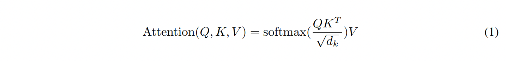
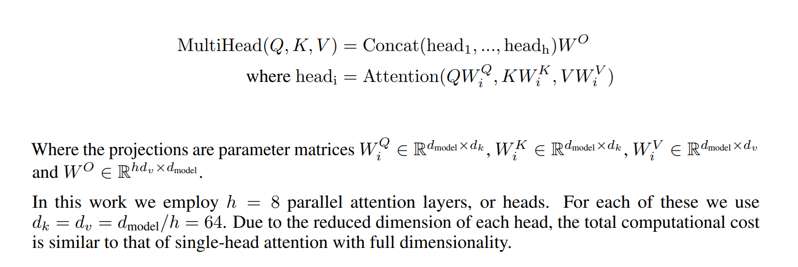

# Attention Is All You Need

## Abstract 
The dominant sequence transduction models are based on complex recurrent or convolutional neural networks that include an encoder and a decoder. The best
performing models also connect the encoder and decoder through an attention mechanism. We propose a new simple network architecture, the Transformer,
based solely on attention mechanisms, dispensing with recurrence and convolutions entirely. Experiments on two machine translation tasks show these 
models to be superior in quality while being more parallelizable and requiring significantly less time to train. Our model achieves 28.4 BLEU on the WMT 
2014 Englishto-German translation task, improving over the existing best results, including ensembles, by over 2 BLEU. On the WMT 2014 English-to-French 
translation task, our model establishes a new single-model state-of-the-art BLEU score of 41.0 after training for 3.5 days on eight GPUs, a small 
fraction of the training costs of the best models from the literature.

## 摘要
目前主要序列转入模型主要是基于复杂的循环或卷积神经网络，这样网络一般是编码器和解码器架构。在这些性能最好的模型之间还通过一个注意机制连接编码器和解码器。我们提出了一种新的简单网络结构即Transformer，它完全基于注意机制，完全不需要递归和卷积。对两个机器翻译任务的实验表明，这些模型在质量上更优，同时更具并行性，训练时间明显更少。对两个机器翻译任务的实验表明，这些模型在质量上更优，同时更具并行性，训练时间明显更少。我们的模型在WMT 2014英语翻译任务中实现了28.4 BLEU，比现有的最佳效果（包括合奏）提高了2倍以上。在WMT2014英语到法语翻译任务中，我们的模型在8个GPU上训练3.5天后建立了一个新的单一模型，即最先进的BLEU分数41.8，这只是文献中最佳模型训练成本的一小部分。结果表明，该Transformer可以很好地推广到其他任务中，并成功地应用于大样本和有限样本的英语用户分析。

## 1 Introduction
Recurrent neural networks, long short-term memory [12] and gated recurrent [7] neural networks in particular, have been firmly established as state of 
the art approaches in sequence modeling and transduction problems such as language modeling and machine translation [29, 2, 5]. Numerous efforts have 
since continued to push the boundaries of recurrent language models and encoder-decoder architectures [31, 21, 13].

Recurrent models typically factor computation along the symbol positions of the input and output sequences. Aligning the positions to steps in 
computation time, they generate a sequence of hidden states ht, as a function of the previous hidden state ht−1 and the input for position t. This 
inherently sequential nature precludes parallelization within training examples, which becomes critical at longer sequence lengths, as memory constraints 
limit batching across examples. Recent work has achieved significant improvements in computational efficiency through factorization tricks [18] and 
conditional computation [26], while also improving model performance in case of the latter. The fundamental constraint of sequential computation, 
however, remains.

Attention mechanisms have become an integral part of compelling sequence modeling and transduction models in various tasks, allowing modeling of 
dependencies without regard to their distance in the input or output sequences [2, 16]. In all but a few cases [22], however, such attention mechanisms
are used in conjunction with a recurrent network.

In this work we propose the Transformer, a model architecture eschewing recurrence and instead relying entirely on an attention mechanism to draw global 
dependencies between input and output. The Transformer allows for significantly more parallelization and can reach a new state of the art in translation 
quality after being trained for as little as twelve hours on eight P100 GPUs.

## 1 导言

递归神经网络(RNN)，特别是长短时记忆(LSTM)[13]和门控递归(GRU)[7]神经网络，已经在时间序列模型和转导问题领域，如语言模型、机器翻译[35,2,5]等任务中，已经成为目前最先进的方法。目前，
还有许多努力尝试去继续推动循环语言模型和编解码器架构的应用边界[38,24,15]。

循环模型通常是沿着输入和输出序列的符号位置进行因子计算。将位置与计算时间中的步骤对齐，先前隐藏状态ht−1的函数和位置t的作为输入，生成一系列隐藏状态ht.这种固有的顺序性排除了训练示例中的
并行化,由于内存限制约束批处理，序列化长度变得至关重要。最近一些工作通过因子分解技巧[21]和条件计算[32]显著提高了计算效率，同时在后者的情况下也提高了模型性能。然而，顺序计算的基本约束
仍然存在。

注意力机制已经成为各种序列建模和转换模型中引人注目的组成部分，模型依赖可以不考虑输入或输出序列中的距离的情况[2，19]。然而，在除少数情况外下[27]，这种注意力机制还是与循环网络相结合使用。

在这项工作中，我们提出了Transformer，一个避免了循环的模型架构，它完全依赖一个注意机制来绘制输入和输出之间的全局依赖性。Transformer 允许更大程度的并行化，可以在8个p100 gpu上经过
短短12小时的训练后，在翻译质量上达到一个新的水平。

## 2 Background

The goal of reducing sequential computation also forms the foundation of the Extended Neural GPU[20], ByteNet[15] and ConvS2S[8], all of which use 
convolutional neural networks as basic building block, computing hidden representations in parallel for all input and output positions. In these models,
the number of operations required to relate signals from two arbitrary input or output positions grows in the distance between positions, linearly for 
ConvS2S and logarithmically for ByteNet. This makes it more difficult to learn dependencies between distant positions [11]. In the Transformer this is
reduced to a constant number of operations, albeit at the cost of reduced effective resolution due to averaging attention-weighted positions, an effect 
we counteract with Multi-Head Attention as described in section 3.2.

Self-attention, sometimes called intra-attention is an attention mechanism relating different positions of a single sequence in order to compute a 
representation of the sequence. Self-attention has been used successfully in a variety of tasks including reading comprehension, abstractive summarization, textual entailment and learning task-independent sentence representations [4, 22, 23, 19].

End-to-end memory networks are based on a recurrent attention mechanism instead of sequencealigned recurrence and have been shown to perform well on 
simple-language question answering and language modeling tasks[28].

To the best of our knowledge, however, the Transformer is the first transduction model relying entirely on self-attention to compute representations of 
its input and output without using sequencealigned RNNs or convolution. In the following sections, we will describe the Transformer, motivate
self-attention and discuss its advantages over models such as [14, 15] and [8].

## 2 背景

扩展神经GPU〔16〕、ByteNet〔18〕和ConvS2S〔9〕都是为了减少序列计算，所有这些都使用卷积神经网络作为基本构建块，并使用并行的方式来计算所有输入和输出位置的隐藏表示。ConvS2S是线性的，ByteNet是对数计算量。这使得学习远距离位置之间的依赖性变得更加困难[12]。在Transformer中，这被减少到一个恒定的操作次数，尽管代价是由于平均注意加权位置而降低了有效分辨率，我们用3.2节中描述的多头注意来抵消这种影响。

自我注意（Self-attention），有时被称为内注意，是一种注意力机制，它将一个序列的不同位置联系起来，来计算序列的表示。在阅读理解、抽象总结、文本蕴涵和学习任务独立句子表达等多种任务中，已经成功地运用了Self-attention机制[4]、[27]、[28]、[22]。

端到端的记忆网络是一种基于循环的注意力机制，而不是顺序一致的循环，并且在简单的语言问答和语言建模任务上表现良好[34]。

然而，据我们所知，Transformer是第一个完全依赖于 Self-Attention 来计算其输入和输出表示的转导模型，而不使用序列对齐的RNN或卷积。在下面的章节中，我们将描述Transformer，激发 Self-attention(motivate self-attention)，并讨论它相对于[17]，[18]和[9]等模型的优势。

## 3 Model Architecture
Most competitive neural sequence transduction models have an encoder-decoder structure [5, 2, 29]. Here, the encoder maps an input sequence of symbol representations (x1,...,xn) to a sequence of continuous representations z = (z1,...,zn). Given z, the decoder then generates an output sequence (y1,..., ym) of symbols one element at a time. At each step the model is auto-regressive[9], consuming the previously generated symbols as additional input when generating the next.The Transformer follows this overall architecture using stacked self-attention and point-wise, fully connected layers for both the encoder and decoder, shown in the left and right halves of Figure 1, respectively.

很多具有竞争力的神经序列转导模型都含有编码器-解码器结构[5，2，35]。在这里，编码器将符号表示的输入序列(x1,...,xn)映射为连续表示序列z =  (z1,...,zn) 。给定z, 解码器然后一次生成一个符号的输出序列(y1,..., ym)。在每一步中，模型都是自动回归(auto-regressive)的[10]，在生成下一步时，将先前生成的符号序列作为附加输入。Transformer遵循这一总体架构，使用 堆叠的 Self-attention 和 逐点(point-wise)、全连接的层用于编码器和解码器，分别如图1的左半部分和右半部分所示。

### 3.1 Encoder and Decoder Stacks

Encoder: The encoder is composed of a stack of N = 6 identical layers. Each layer has two sub-layers. The first is a multi-head self-attention  mechanism, and the second is a simple, position-wise fully connected feed-forward network. We employ a residual connection [10] around each of the two 
sub-layers, followed by layer normalization [1]. That is, the output of each sub-layer is LayerNorm(x + Sublayer(x)), where Sublayer(x) is the function 
implemented by the sub-layer itself. To facilitate these residual connections, all sub-layers in the model, as well as the embedding layers, produce 
outputs of dimension dmodel = 512.

Decoder: The decoder is also composed of a stack of N = 6 identical layers. In addition to the two sub-layers in each encoder layer, the decoder inserts 
a third sub-layer, which performs multi-head attention over the output of the encoder stack. Similar to the encoder, we employ residual connections
around each of the sub-layers, followed by layer normalization. We also modify the self-attention sub-layer in the decoder stack to prevent positions 
from attending to subsequent positions. This masking, combined with fact that the output embeddings are offset by one position, ensures that the
predictions for position i can depend only on the known outputs at positions less than i.

## 3.1 编码器和解码器堆栈

编码器：编码器由一组N = 6的相同层堆叠而成。每层有两个子层。第一个子层采用 Multi-Head Self-Attention 机制，第二个是一个简单的，位置导向的，全连接的前馈网络。我们在两个子层之间使用一个 Residual残差连接[11]，然后是层 Normalization[1]。也就是说，每个子层的输出是LayerNorm(x + Sublayer( x ))，其中Sublayer(x)是子层实现的函数。为了方便这些 Residual 连接，规定最后产出得到的对于每个token的embedding的维度是512。

解码器：解码器也由一个N = 6相同层堆叠而成。除了每个编码器层中的两个子层外，解码器还插入第三个子层，该子层在编码器堆栈的输出上执行 Multi-Head Attention。与编码器类似，我们在每个子层周围使用 Residual 连接，然后进行层Normalization。我们还修改了解码器堆栈中的自注意子层，以防止每个位置去关注其后续位置。这个掩膜，结合输出嵌入(the output embeddings)被一个位置偏移(offset)的事实，确保在预测位置i的token时，整个模型将无法看到位置i以后的token信息。

## 3.2 Attention
An attention function can be described as mapping a query and a set of key-value pairs to an output, where the query, keys, values, and output are all 
vectors. The output is computed as a weighted sum of the values, where the weight assigned to each value is computed by a compatibility function of the
query with the corresponding key.

## 3.2 注意力
注意力函数可以描述为从一个查询(query)和一组键值对(key-value pairs)到一个输出的映射，其中，查询(query)、键(key)、值(value)和输出(output)都是向量。输出(output)是以值(value)的加权和进行计算的，其中分配给每个值(value)的权重是通过查询(query)的匹配函数(compatibility function)和相应的键(key)计算的。

### 3.2.1 Scaled Dot-Product Attention

We call our particular attention "Scaled Dot-Product Attention" (Figure 2). The input consists of queries and keys of dimension dk, and values of 
dimension dv. We compute the dot products of the query with all keys, divide each by radical sign dk, and apply a softmax function to obtain the weights on the values.

In practice, we compute the attention function on a set of queries simultaneously, packed together into a matrix Q. The keys and values are also packed together into matrices K and V . We compute the matrix of outputs as:

The two most commonly used attention functions are additive attention [2], and dot-product (multiplicative) attention. Dot-product attention is identical to our algorithm, except for the scaling factor of 1/radical sign dk. Additive attention computes the compatibility function using a feed-forward network with a single hidden layer. While the two are similar in theoretical complexity, dot-product attention is much faster and more space-efficient in practice, since it can be implemented using highly optimized matrix multiplication code.

While for small values of dk the two mechanisms perform similarly, additive attention outperforms dot product attention without scaling for larger values of dk[3]. We suspect that for large values of dk, the dot products grow large in magnitude, pushing the softmax function into regions where it hasextremely small gradients. To counteract this effect, we scale the dot products by 1/radical sign dk

### 3.2.1 缩放点击注意力
我们称我们的特别的关注(attention)为“Scaled Dot-Product Attention”（图2）。输入包括dk维的查询和键，以及dv维的值。我们计算查询与所有键的点积，并将每个点积除以dk 然后应用SoftMax函数得到这些值的权重。

在实践中，我们同时计算一组查询上的注意力函数，将它们打包成矩阵Q。键和值也打包成矩阵K和V。我们计算输出矩阵的方式为：

两个最常用的注意力函数是加性注意(additive attention)[2]和点积（乘法）注意(dot-product attention)。除1/radical sign dk比例因子外，点积注意与我们的算法相同。加性注意使用一个前馈网络和一个单独的隐藏层来计算兼容性函数(compatibility function)。虽然二者在理论复杂度上相似，但在实践中，点积注意速度更快，空间效率更高，因为它可以使用高度优化的矩阵乘法代码来实现。

对于较小的dk值，这两种机制的性能相似，但加性注意优于点积注意，而不会缩放较大的dk值[3]。我们怀疑，对于dk的较大值，点积的增长幅度较大，会将SoftMax函数推送到具有极小梯度的区域。为了抵消这种影响，我们将点积乘以1/radical sign dk。

### 3.2.2 Multi-Head Attention
Instead of performing a single attention function with dmodel-dimensional keys, values and queries, we found it beneficial to linearly project the 
queries, keys and values h times with different, learned linear projections to dk, dk and dv dimensions, respectively. On each of these projected 
versions of queries, keys and values we then perform the attention function in parallel, yielding dv-dimensional output values. These are concatenated 
and once again projected, resulting in the final values, as depicted in Figure 2.

Multi-head attention allows the model to jointly attend to information from different representation subspaces at different positions. With a single attention head, averaging inhibits this.

### 3.2.2 多头注意力
不同于使用dmodel维度的键、值和查询来执行单一注意功能，我们发现，使用另一种可学习的线性投影（projection）分别对查询、键和值进行h次线性投影（projection）会更有效，这些投影将这些元素分别映射到维度为dk，dk，dv的空间。在这些元素的每个投影版本上，我们并行执行注意力函数，得到dv维的输出值。如图2所示，之后它们被连接起来，并再次进行投影，从而得到最终的值。

在这项工作中，我们使用H = 8的并行 attention layers 或 heads。对于每个模型，dk=dv=dmodel/h=64。由于每个头部的降维，总的计算成本与 single-head 全尺寸注意力相似。

## 3.3 Position-wise Feed-Forward Networks
In addition to attention sub-layers, each of the layers in our encoder and decoder contains a fully connected feed-forward network, which is applied to each position separately and identically. This consists of two linear transformations with a ReLU activation in between.

While the linear transformations are the same across different positions, they use different parameters from layer to layer. Another way of describing this is as two convolutions with kernel size 1. The dimensionality of input and output is dmodel = 512, and the inner-layer has dimensionality
dff = 2048.

## 3.3 全连接前馈网络
除了关注子层之外，我们的编码器和解码器中的每个层都包含一个完全连接的前馈网络，该网络分别应用于每个position，并且完全相同。该网络也包括有两个通过ReLU连接起来的线性变换。

虽然线性变换在不同的位置上是相同的，但它们在不同的层之间使用不同的参数。另一种描述这一点的方法是两个内核大小为1的卷积。输入输出维数为dmodel = 512，内层维数为dff=2048。

## 3.4 Embeddings and Softmax
Similarly to other sequence transduction models, we use learned embeddings to convert the input tokens and output tokens to vectors of dimension dmodel. 
We also use the usual learned linear transformation and softmax function to convert the decoder output to predicted next-token probabilities. In our 
model, we share the same weight matrix between the two embedding layers and the pre-softmax linear transformation, similar to [24]. In the embedding 
layers, we multiply those weights by radical sign dmodel.
 
## Conclusion
In this work, we presented the Transformer, the first sequence transduction model based entirely on attention, replacing the recurrent layers most 
commonly used in encoder-decoder architectures with multi-headed self-attention. 

For translation tasks, the Transformer can be trained significantly  faster than architectures based on recurrent or convolutional layers. On both WMT 
2014 English-to-German and WMT 2014 English-to-French translation  tasks, we achieve a new state of the art. In the former task our best model 
outperforms even all previously reported ensembles.

We are excited about the future of attention-based models and plan to apply them to other tasks. We plan to extend the Transformer to problems involving 
input and output modalities other than text and to investigate local, restricted attention mechanisms to efficiently handle large inputs and outputs such 
as images, audio and video. Making generation less sequential is another research goals of ours. 

The code we used to train and evaluate our models is available at https://github.com/tensorflow/tensor2tensor

## 结论
在这项工作中，我们提出了完全基于注意的第一序列转导模型Transformer，用多头自注意取代了编码器-解码器体系结构中最常用的循环层。

对于翻译任务，Transformer的训练速度明显快于基于循环层或卷积层的架构。在WMT 2014英语到德语和WMT 2014英语到法语的翻译任务中，我们实现了一种新的艺术状态。在上面所做工作中，我们的最佳模型表现甚至超过了之前所有模型。

我们对基于注意力的模型的未来感到兴奋，并计划将其应用到其他任务中。我们计划将Transformer扩展到涉及输入和输出模式而不是文本的问题，并研究局部的、受限制的注意力机制，以有效地处理大量输入和输出，如图像、音频和视频。减少生成的序列化是我们的另一个研究目标。

我们用来训练和评估模型的代码可以在https://github.com/tensorflow/tensor2tensor上找到。

## 学习视频
[Attention Is All You Need 论文翻译 1](https://blog.csdn.net/qq_29695701/article/details/88096455)

[Attention Is All You Need 论文翻译 2](http://t.zoukankan.com/wwj99-p-12156301.html)

[Transformer模型详细解读（理论篇）](https://blog.csdn.net/a_123zxy/article/details/120160302)

[跟李沐学AI](https://www.bilibili.com/video/BV1pu411o7BE?spm_id_from=333.337.search-card.all.click&vd_source=97f3f76c3508d1560f7e42c25682c326)

[李宏毅 transformer精讲](https://www.youtube.com/watch?v=ugWDIIOHtPA&list=PLJV_el3uVTsOK_ZK5L0Iv_EQoL1JefRL4&index=62)

[汉语自然语言处理-从零解读碾压循环神经网络的transformer模型(一)](https://www.bilibili.com/video/BV1P4411F77q?spm_id_from=333.880.my_history.page.click&vd_source=97f3f76c3508d1560f7e42c25682c326)
